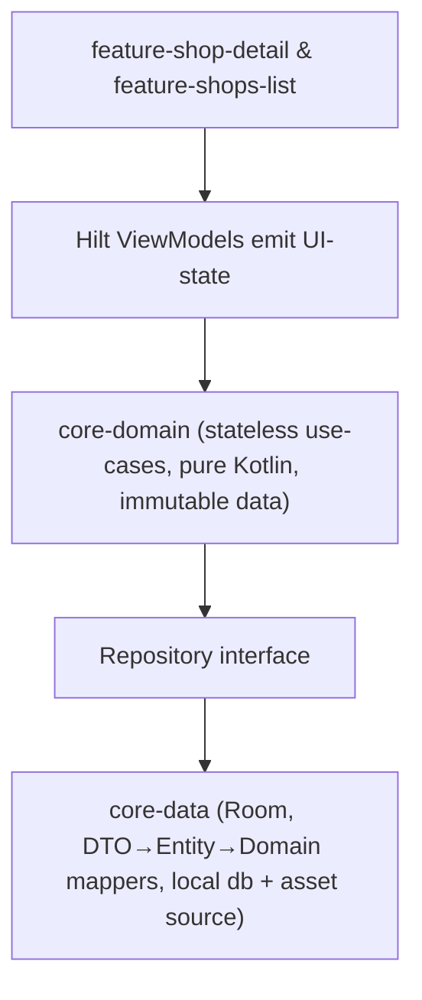

# 🍶 Shops – Nagano Sake Guide

Discover breweries, bottle shops, and tasting bars across Nagano Prefecture.

## Modules

| Module                 | Responsibility                                  |
|------------------------|-------------------------------------------------|
| **app**                | Android launcher + global navigation graph      |
| **core-domain**        | Pure Kotlin business models & use-cases         |
| **core-data**          | Local DB (Room), asset data source, repository  |
| **core-ui**            | Design system, reusable Compose components      |
| **feature-shops-list** | List & refresh logic                            |
| **feature-shop-detail**| Detail screen & geo/web intents                 |

---

## ✨ Why another “clean architecture” demo?

1. **Showcase a _real_ multi-module setup:**  
   Every layer is in its own Gradle module, so build times stay short and features remain plug-and-play.
2. **Exercise the latest tooling** (June 2025):  
   Kotlin 2.1, Compose BOM 2025-06, AGP 8.1x, Room 2.7, Hilt 2.56, Retrofit 3, OkHttp 4.12.
3. **Document mindful decisions:**  
   The README you are reading is as important as the code; it surfaces context that is usually buried in PR discussions.

---

## 🏗️ Architecture at a glance

- **Unidirectional data flow:** `ObserveShopsUseCase → StateFlow → Compose`
- **Offline-first:** All content is cached in Room; currently seeded from _assets/shops.json_ but the API boundary is in place.
- **Dependency Injection:** One Hilt module (`DataModule`) wires everything; each feature only depends on the public surface of lower layers.
- **Version Catalog (`libs.toml`):** Keeps every dependency in one place and avoids mismatched transitive versions (e.g., global _javapoet_ pin).

---

## 🛠️ Building & Running

| Requirement     | Version / Notes                         |
|-----------------|-----------------------------------------|
| Android Studio  | Iguana 🐱‍👤 (or newer)                  |
| JDK             | 17+                                     |
| Android SDK     | 36 (compile/target); minSdk 33          |

---

## 🧩 Key implementation decisions

**Topic**               | **Choice & Rationale**
------------------------|---------------------------------------------------------
Data format             | Kept a small JSON asset to focus on architecture, not network edge-cases.
Room DB                 | Provides reactive Flow queries, auto migration, and indexes.
Compose Material 3      | Aligns with Google’s current design guidance; theming centralized in core-ui.
Coil                    | Lightweight image loader with AsyncImage for Compose.
Gradle Version Catalog  | Single source of truth; enables alias(libs.plugins…) syntax.
compileSdk 36           | Future-proofs the sample; cleartextTrafficPermitted=true in network_security_config.xml only for quick prototypes.

---

## 🧪 Testing Status

**Layer**                  | **Coverage**
---------------------------|-----------------------------------------
Pure Kotlin (domain, mappers) | ☑️ JUnit 4 unit tests
ViewModels (state mapping)     | ⬜ TODO – would use Kotlin Flows + Turbine
UI (Compose)                   | ⬜ TODO – would add androidx.ui.test rules
Instrumentation                | Boilerplate sample only

_Time constraints limited test breadth; see Roadmap._

---

## ⚠️ Known limitations

- Data is read-only; there is no persistence of user actions (e.g. favourites, reviews).
- No runtime permissions or graceful errors if no map app is installed.
- Accessibility needs work: content descriptions, talk-back traversal order, contrast audit.
- No CI pipeline—local `./gradlew lint test` only.

---

## 🚀 Roadmap / “If I had more time…”

- Real network layer – Retrofit 3 client with E‑Tag / 304 caching, fallback to assets when offline.
- Pagination & search – integrate Paging 3, fuzzy search on name/description.
- Design polish – animated placeholder images, Compose transitions, tablet layout.
- Comprehensive test suite – Turbine for Flow testing, Robolectric for ViewModels, Screenshot tests for Compose.
- Continuous Integration – GitHub Actions running lint + unit + instrumentation on every PR.
- Feature flags & A/B experiments – use DataStore + Kotlin multiplatform Settings.
- Internationalisation – string resources & RTL layouts; Japanese/English at minimum.
- Analytics & crash reporting – Firebase or open-source alternatives (while respecting user privacy).
- KMP sharing – migrate core-domain and core-data to jvm() + ios() targets to reuse logic in an iOS client.

---
